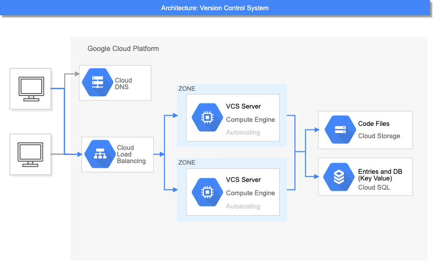
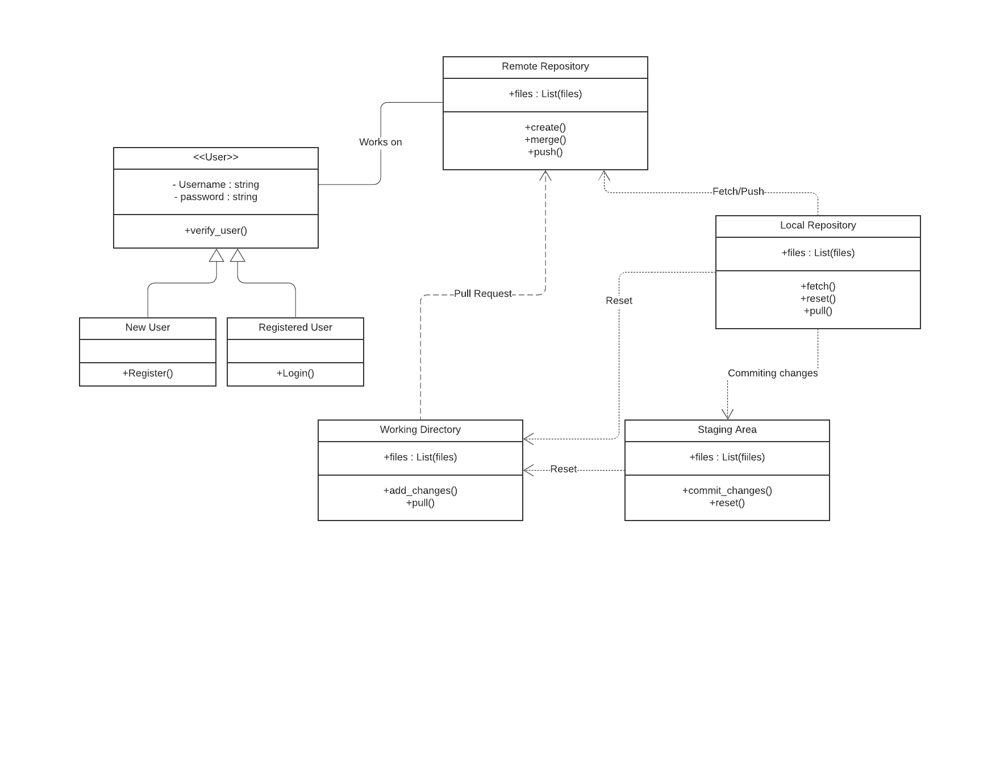
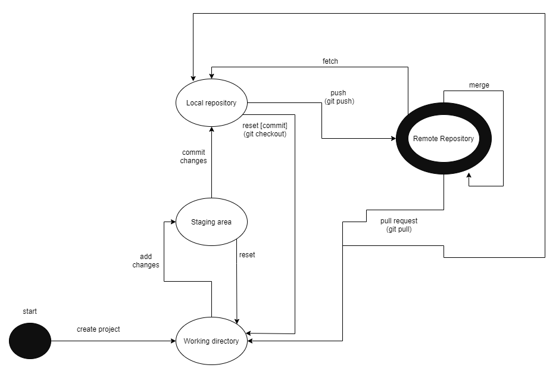
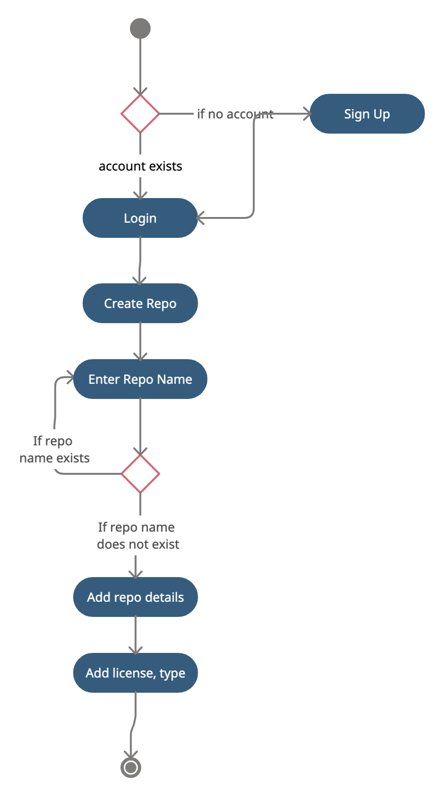
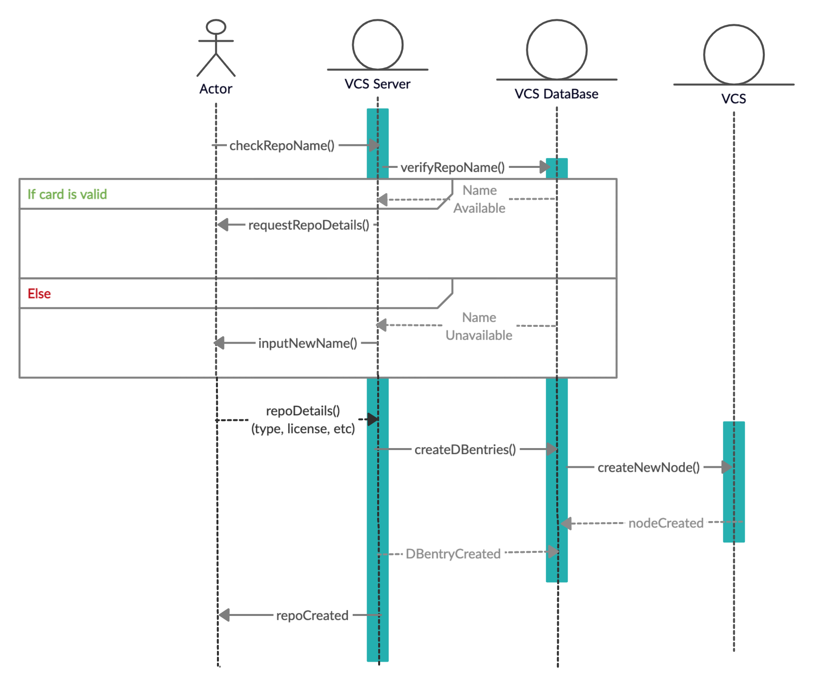
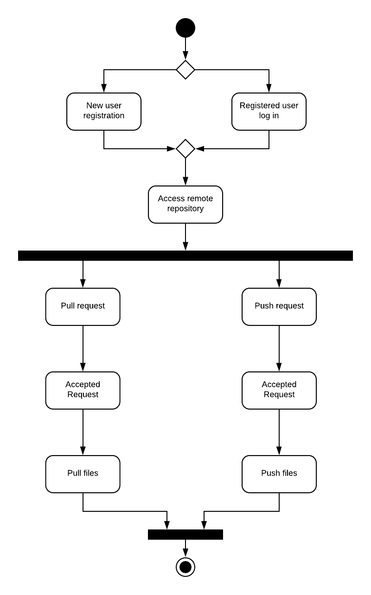
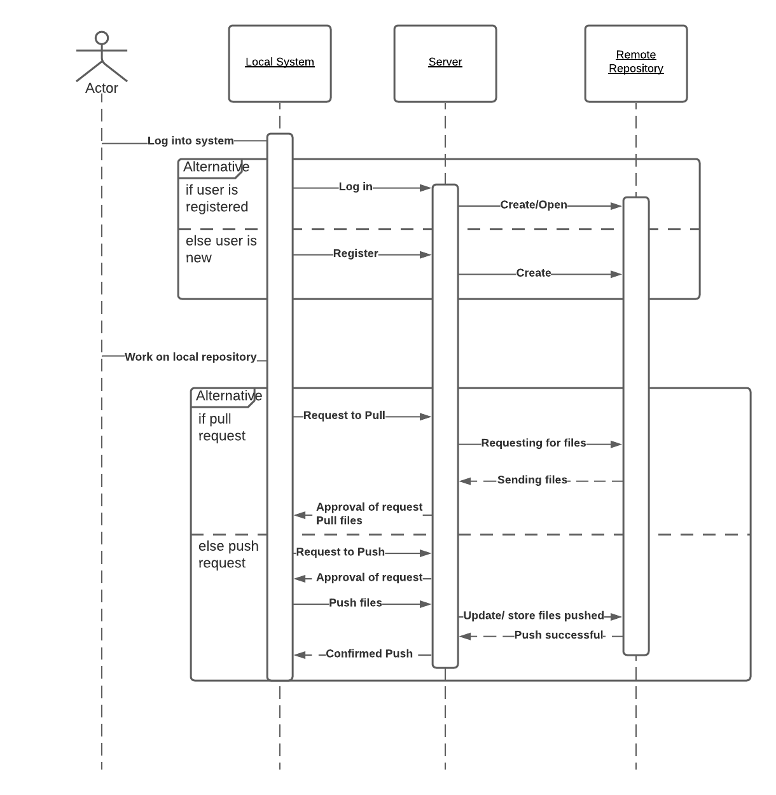
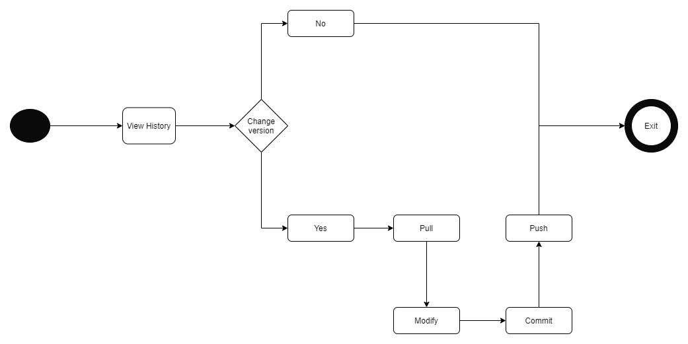
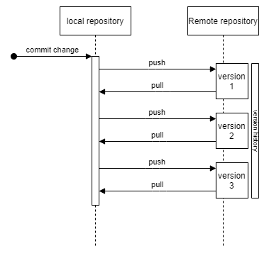

This is a VCS system implemented for the course Object Oriented Analysis and Design of Software Engineering.

Architecture Diagram

Class Diagram

State Diagram

The use cases planned to be implemented are

1. Create Repository
2. Push/Pull Requests
3. View Version History

Use Case Diagrams

1. Create Repository
   Activity Diagram
   
   Activity Diagram
   

2. Push/Pull Requests
   Activity Diagram
   
   Sequence Diagram
   

3. View Version History
   Activity Diagram
   
   Sequence Diagram
   
